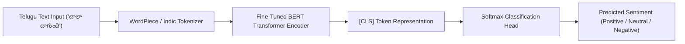
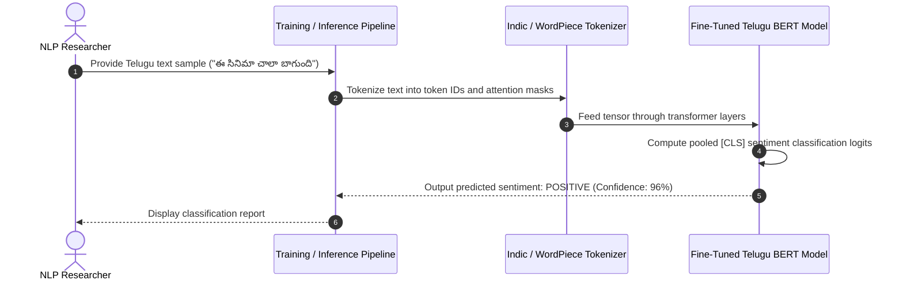

# TeluguAI — Fine-Tuning BERT for Telugu Sentiment Classification
[]()
[]()
[]()
[]()

## Overview
TeluguAI is a specialized Natural Language Processing (NLP) research project focusing on fine-tuning multilingual BERT (`bert-base-multilingual-cased` / IndicBERT) models for sentiment analysis, opinion mining, and text classification in the Telugu language (తెలుగు).

- **Problem Solved:** Low-resource NLP classification for Dravidian regional languages with complex agglutinative morphology.
- **Target Users:** NLP researchers, computational linguists, and AI data scientists.
- **Current Status:** Completed Academic Research Project.

## Features
- **Transformer Fine-Tuning Pipeline:** Adaptation of pre-trained transformer representations to Telugu sentiment corpora.
- **Comprehensive Research Paper:** Detailed methodology, experimental results, and architectural analysis in `fine_tunning_sentimental_Telugu.pdf`.
- **Performance Evaluation:** Benchmarks covering accuracy, macro-F1 scores, and confusion matrix diagnostics across positive, negative, and neutral sentiment classes.

## Architecture


## User Flow


## Technology Stack
| Layer | Technology | Purpose |
|---|---|---|
| Deep Learning | PyTorch, Hugging Face Transformers | Model fine-tuning and tokenizer pipeline |
| Language Models | mBERT / IndicBERT | Pre-trained multilingual contextual embeddings |
| Data & Evaluation | Pandas, Scikit-learn, NumPy | Dataset processing and evaluation metrics |
| Research Documentation | LaTeX / PDF | Complete technical research publication |

## Infrastructure
- **Compute Target:** Google Colab / Local GPU with PyTorch CUDA acceleration.

## Project Structure
```text
Teluguai/
├── Fine-Tuning-BERT-for-Telugu-Sentiment-Classification--main/
│   ├── fine_tunning_sentimental_Telugu.pdf  # Comprehensive academic research publication
│   ├── Project file                          # Jupyter Notebook / Python training script
│   └── README.md                             # Original project notes
├── .gitignore                                # Git ignore definitions
└── README.md                                 # Technical documentation
```

## Prerequisites
- Python >= 3.9
- PyTorch >= 2.0
- Hugging Face `transformers`, `datasets`, `evaluate`

## Environment Variables
*Not required.*

## Local Development Setup
1. Clone the repository:
   ```bash
   git clone https://github.com/Bhanutejanallamothu/Teluguai.git
   cd Teluguai
   ```
2. Read the research paper:
   Open `Fine-Tuning-BERT-for-Telugu-Sentiment-Classification--main/fine_tunning_sentimental_Telugu.pdf`.
3. Run training notebook:
   Launch the training script / notebook in Jupyter or Google Colab with GPU runtime enabled.

## Docker Setup
*Not applicable.*

## Database Setup
*Not applicable. Training corpora loaded from CSV/JSON datasets.*

## API Documentation
Inference workflow:
```python
from transformers import pipeline
classifier = pipeline("sentiment-analysis", model="path/to/fine_tuned_telugu_bert")
print(classifier("ఈ సినిమా చాలా బాగుంది!"))
```

## Deployment
Export model weights as ONNX or Hugging Face Model Hub repo for serving via FastAPI.

## Security
- Safe model weight loading via PyTorch safe tensors.

## Testing
Verify evaluation metrics on validation split using Scikit-learn classification report.

## Troubleshooting
- **Out of Memory on GPU:** Decrease batch size to 8 or 16 and enable mixed-precision `fp16=True`.

## Future Improvements
- Expand training corpus with modern social media dialect annotations.
- Deploy a live Telugu sentiment analysis web demo via Streamlit.

## License
Academic NLP research project. All rights reserved by repository owner.
